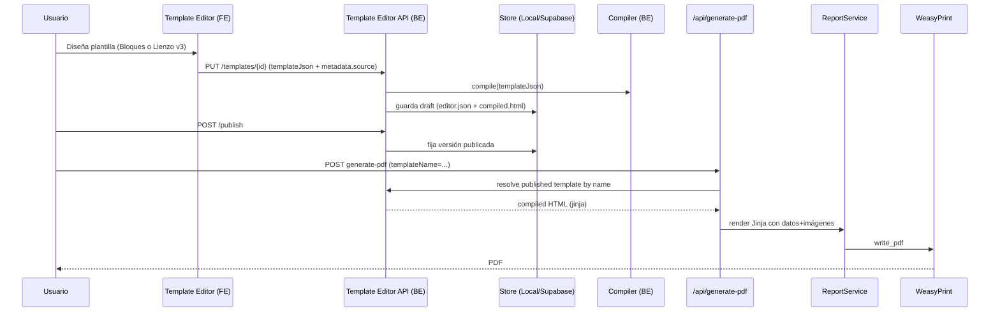

# Evaluación y plan de mejora del Template Editor de stichgio/0752 hacia una experiencia tipo Canva compatible con el generador de reportes

## Resumen ejecutivo

El repositorio es un monorepo con backend en FastAPI + renderizado PDF vía WeasyPrint y frontend en React + Vite multi‑página. El “Template Editor” actual **funciona como un editor por bloques** (no como un lienzo libre estilo entity["company","Canva","design platform"]) y compila a HTML/Jinja para integrarse con el endpoint de generación de PDFs sin cambiar el contrato de API. fileciteturn42file0L1-L200 fileciteturn42file18L1-L220 fileciteturn58file7L1-L220

Hallazgos clave:

- **Compatibilidad con generador ya resuelta en backend**: el endpoint `/api/generate-pdf` soporta `templateName` y, si corresponde a una plantilla “publicada” por el editor, el backend la resuelve a HTML compilado (sin cambiar el contrato). fileciteturn42file18L1-L220
- **El repositorio contiene piezas “latentes” de un editor tipo lienzo** en frontend (tipos de documento con `x/y/width/height/zIndex/rotation` + reducer con selección/mover/duplicar), pero **no están conectadas al UI actual**, y el compilador backend **ignora el layout absoluto en el modo legacy**. fileciteturn45file0L1-L200 fileciteturn44file0L1-L220 fileciteturn40file2L1-L240
- **El mayor bloqueo técnico para “Canva‑like” no es el almacenamiento ni el publish**, sino el “render pipeline”: falta un compilador que traduzca un “documento de lienzo” (con posiciones, capas, estilos) a HTML/CSS apto para WeasyPrint. fileciteturn40file2L1-L240
- WeasyPrint soporta `@page` para tamaño/márgenes, lo que encaja bien con un editor que trabaje en milímetros y A4. citeturn5search0

Recomendación de alto nivel (incremental y retrocompatible):

1) **Introducir un “Canvas Template Mode”** (lienzo libre WYSIWYG) en el frontend reutilizando los tipos/reducer existentes;  
2) **Actualizar el compilador backend** para soportar `metadata.source = "canvas-editor-v3"` y generar HTML con posicionamiento absoluto en unidades físicas (mm);  
3) Mantener el editor por bloques como “modo rápido/seguro” para plantillas estructuradas y asegurar compatibilidad total con el generador actual.

## Hallazgos clave del repositorio

Arquitectura y despliegue:

- Backend: FastAPI, endpoints de herramientas PDF, y generación de PDF con Jinja2 + WeasyPrint; `Dockerfile` orientado a entity["company","Hugging Face","ai platform"] Spaces (backend‑only). fileciteturn42file18L1-L220 fileciteturn65file0L1-L200
- Frontend: React 18 + Vite multi‑entrada (páginas separadas `index.html`, `template-editor.html`, etc.). fileciteturn42file9L1-L80 fileciteturn42file3L1-L120 fileciteturn58file0L1-L120
- Dependencias relevantes:
  - Frontend: `framer-motion`, `html2canvas`, `lucide-react`. No hay librería de canvas (Konva/Fabric) instalada actualmente. fileciteturn42file9L1-L80
  - Backend: `weasyprint`, `jinja2`, `bleach`, `supabase`, `pypdf`; soporte Ghostscript para compresión. fileciteturn65file7L1-L80 fileciteturn65file0L1-L200

Persistencia de plantillas del Template Editor:

- Existe un store local en JSON (archivo) y un store en entity["company","Supabase","backend-as-a-service"] con tablas `templates` y `template_versions`, y almacenamiento de objetos (`editor.json` y `compiled.html`). fileciteturn35file2L1-L260 fileciteturn49file0L1-L200 fileciteturn51file2L1-L80
- El backend ya maneja versiones (publish idempotente, rollback) y lista de publicadas, lo cual es una buena base para versionado tipo Canva (aunque aún falta “historial visual” y diffs de diseño significativos). fileciteturn35file2L1-L260

Compatibilidad con el generador:

- El endpoint `/api/templates` retorna plantillas “legacy” (HTML en disco) y también “editorTemplates” (publicadas por el editor). fileciteturn42file18L1-L220
- En generación PDF, si llega `templateName` (y no llega `customTemplate`), el backend intenta resolver por nombre una plantilla publicada del editor y la pasa como `custom_template_str` a `ReportService`. fileciteturn42file18L1-L220 fileciteturn38file0L1-L260

## Estado actual del Template Editor

Backend (API y modelo):

- API `FastAPI` del editor:
  - catálogo de variables `/api/template-editor/variables/catalog`
  - CRUD de plantillas `/api/template-editor/templates`
  - preview `/preview`, validate `/validate`, publish `/publish`, rollback, delete
  - publish protegido por feature flag `FEATURE_TEMPLATE_EDITOR`. fileciteturn58file3L1-L200
- La sanitización HTML se aplica sobre `block.content` con `bleach` (si está disponible) y fallback defensivo; también elimina handlers inline y `<script>/<iframe>`. fileciteturn35file1L1-L120
- Modelo de plantillas del editor (backend) es “block‑based”: `TemplateJson` contiene `sections[]` y `blocks[]` con `type/content/metadata/locked`, más `protectionRules` y `variableBindings`. fileciteturn25file0L1-L220

Compilación (render pipeline):

- El compilador backend tiene un modo “block-editor” (detectado por `metadata.source`) y un modo “legacy” para otros casos. El modo block genera HTML completo (A4, CSS) y Jinja `report_list` para compatibilidad con batch. fileciteturn40file2L1-L240
- Existe un mapper en frontend que convierte un `TemplateDocument` (con `x/y/w/h/zIndex/rotation`) a un “legacy TemplateJson” guardando layout en `metadata.layout`, pero el compilador legacy **no usa ese layout** para posicionar elementos. Resultado: un futuro editor lienzo no sería WYSIWYG en PDF si no se actualiza el compilador. fileciteturn45file0L1-L200 fileciteturn40file2L1-L240

Frontend (UI actual):

- La página `template-editor.html` carga un componente `TemplateEditor` en React. fileciteturn58file0L1-L120
- El `TemplateEditor` actual es un **builder por bloques** (con historial undo/redo local, guardado, publish, export JSON/HTML) y serializa a `TemplateJson` con `metadata.source = "block-editor"`. fileciteturn58file7L1-L120
- `BlockEditor.tsx` implementa paleta de bloques, edición de configuración, reordenación y representación estilo “página” pero **no** un lienzo libre (capas, guías, transformaciones arbitrarias). fileciteturn42file19L1-L220

Problema funcional importante (preview):

- El endpoint backend de preview hace sustitución por regex del tipo `{{ variable }}` sobre el HTML compilado. Pero el compilador y las plantillas del generador usan accesos del estilo `report.data.get(...)`, por lo que el preview no puede representar fielmente el resultado real en muchos casos. fileciteturn58file3L1-L120 fileciteturn40file2L1-L240

## Brecha frente a un editor tipo Canva

image_group{"layout":"carousel","aspect_ratio":"16:9","query":["interfaz editor Canva lienzo capas alineación","Canva editor barra lateral elementos texto fondos","Canva editor guías y alineación captura"],"num_per_query":1}

Comparación (lo que falta para aproximarse a entity["company","Canva","design platform"]):

- **Lienzo WYSIWYG real**: en Canva el usuario posiciona elementos libremente; el editor actual es “layout por bloques”. fileciteturn42file19L1-L220
- **Capas**: panel de capas (z‑index), bloqueo por elemento, reordenación y agrupación. En el repo hay lógica de `zIndex/selection/duplicate/delete` en reducer, pero no UI integrada. fileciteturn44file0L1-L220
- **Alineación avanzada**: snapping a grid, guías, distribución, alineación a bordes/centros, “smart guides”.
- **Transformaciones**: resize handles, rotación, escala, multi‑selección, copiar/pegar, atajos consistentes.
- **Tipografía y estilos**: familias, pesos, interlineado, tracking, estilos por rangos (rich text), efectos (sombras, contornos).
- **Assets**: biblioteca de imágenes/iconos, placeholders dinámicos, gestión de recursos.
- **Colaboración** (opcional): cursores, presencia y sincronización multiusuario. Yjs soporta awareness y providers como `y-websocket`. citeturn7search7turn7search0
- **Versionado**: diseño con historial, restauración, diffs. El backend ya tiene versionado técnico (publish/rollback), pero no “diff visual/semántico” útil al usuario. fileciteturn35file2L1-L260

La brecha crítica: **pipeline de render final**. Si el editor pasa a lienzo libre, el compilador debe traducir coordenadas/estilos a HTML/CSS/WeasyPrint con un resultado estable. WeasyPrint soporta `@page` para controlar tamaño/márgenes, y soporta muchas unidades físicas (mm, pt, px), lo que permite un enfoque “diseño en mm”. citeturn5search0turn5search2turn5search6

## Propuesta técnica para un editor tipo Canva compatible con el generador

### Objetivo de diseño

Crear un **Canvas Template Editor** (modo lienzo libre) que:

- Edite una “página A4” con unidades físicas (mm como unidad primaria).
- Serialice a un **documento de diseño** (JSON) con elementos posicionados, capas y estilos.
- Compile a **HTML/Jinja compatible** con el `ReportService.generate_batch_pdf` existente (sin romper contratos). fileciteturn38file0L1-L260
- Mantenga el editor por bloques actual como modo alternativo (retrocompatibilidad y plantillas estructuradas). fileciteturn58file7L1-L120

### Modelo de datos propuesto (schema v3)

Reutilizar el concepto existente de `TemplateDocument` del frontend (posiciones `x/y/...`) y formalizarlo como “v3”, evitando HTML libre en el editor para reducir XSS:

- `TemplateDocumentV3`
  - `page`: `{ size: 'A4', orientation, marginMm, bleedMm?, gridMm? }`
  - `elements[]`: cada elemento con
    - `id`, `type`, `xMm`, `yMm`, `widthMm`, `heightMm`, `rotationDeg`, `zIndex`, `locked`
    - `style`: objeto tipado (sin strings CSS arbitrarios)
    - `binding` (si aplica): referencia a datos (`report.data`), imágenes (`report.images`), logos, etc.
  - `schemaVersion: 3`
  - `metadata`: autor, timestamps, etc.

En backend, **no es necesario romper `TemplateJson`** (API actual). Se puede transportar como `TemplateJson` donde cada `block` representa un `element`, guardando `layout/style/binding` en `block.metadata`, y marcando `templateJson.metadata.source = "canvas-editor-v3"`. Esto ya es consistente con el patrón block-editor: el frontend actual ya “empaqueta” config en `metadata`. fileciteturn58file7L1-L120

### Compilación a HTML/Jinja (núcleo del cambio)

Actualizar `backend/template_editor/compiler.py` para:

- Detectar `metadata.source == "canvas-editor-v3"`.
- Generar HTML base (doctype, CSS A4, contenedor `.page` con `position: relative`).
- Renderizar cada elemento como capa absoluta:

  - `style="position:absolute; left:Xm m; top:Ym m; width:Wm m; height:Hm m; transform: rotate(...deg); z-index: ...;"`

- Para bindings:
  - Texto variable seguro: `{{ report.data.get('CLAVE', '-') }}` (o binding tipado con fallback).
  - Imagen dinámica: `report.images[n].path` con guardas de longitud como el compilador ya hace para photo-grid. fileciteturn40file2L1-L240
  - Logos: `logo_left / logo_right` (ya existen en el contexto del generador y en las plantillas por defecto). fileciteturn40file1L1-L120 fileciteturn38file0L1-L260

Esto convierte el editor lienzo en **WYSIWYG real para PDF**, porque WeasyPrint renderiza HTML/CSS paginados usando `@page`. citeturn5search0turn5search6

### Vista previa fiable (backend)

Sustituir el preview por “regex replace” por un render real del template con un contexto simulado compatible con el generador:

- Contexto mínimo:
  - `reports = [{ data: sampleData, images: sampleImages..., layout_mode, img_count }]`
  - `report = sampleData` (aunque el template de editor suele iterar `report_list` y sombrear `report`) fileciteturn40file1L1-L120
  - `logo_left/logo_right` opcionales

Esto es crucial cuando el template usa `report.data.get(...)`. fileciteturn58file3L1-L120

### Librerías recomendadas (comparativa)

Tabla comparativa enfocada en “editor tipo Canva + salida HTML/WeasyPrint”:

| Alternativa | Modelo de render | Serialización | Ventajas | Riesgos / trade-offs | Encaje con WeasyPrint |
|---|---|---|---|---|---|
| DOM/HTML con posicionamiento absoluto + handles (recomendado v1) | DOM (divs) | JSON propio | Salida a HTML directa; bindings Jinja naturales; fácil “pixel perfect” en mm; no dependes de canvas | Implementar selección/resize/rotación es trabajo; hay que cuidar performance con muchos nodos | Muy alto: output es HTML/CSS nativo; `@page` y unidades soportadas citeturn5search0turn5search6 |
| entity["company","Fabric.js","canvas rendering library"] | Canvas 2D | `toObject()/toJSON()` | Toolkit maduro: selección, transform, zoom; exporta JSON/SVG; buena base de editor gráfico citeturn6search4turn6search0 | Compilar a HTML/Jinja es más complejo; SVG + variables es delicado; texto y fuentes pueden divergir | Medio: mejor vía SVG export, pero requiere validar compatibilidad SVG/WeasyPrint |
| Konva | Canvas 2D | `stage.toJSON()`, `Node.create()` citeturn0search8turn0search9 | Alto rendimiento y capas; buena interactividad; ecosistema | Sin export SVG nativo; salida a HTML/Jinja no directa; más trabajo para “PDF exacto” | Medio-bajo: pipeline a PDF más complejo |
| “Solo block editor” (actual) | DOM por bloques | JSON por bloques | Muy controlado; fácil validación; plantillas consistentes | No es libre/creativo; no “Canva-like” | Alto pero sin libertad creativa |

Recomendación: **DOM absoluto en mm** para el “Canvas Editor v3” (por compatibilidad y menor riesgo), y mantener abierta la puerta a Fabric/Konva si en el futuro se requiere un motor gráfico más potente.

### Estado, undo/redo y rendimiento

- Para drag & drop (paletas, capas, ordenar), `@dnd-kit` es una opción sólida; destaca extensibilidad, rendimiento y guía de accesibilidad. citeturn4search0turn4search6turn4search8
- Para estado de editor (documento, selección, history):
  - Opción ligera: entity["company","Zustand","state management library"] con persistencia/devtools middleware. citeturn6search1
  - Opción “enterprise”: Redux Toolkit (`createSlice`) + middleware de history. citeturn6search7
- Rendimiento:
  - Virtualizar listas (capas/assets) y usar transformaciones CSS (translate/scale) en el viewport.
  - Mantener el documento como estructuras inmutables y patching (evitar re‑renders globales).
  - Definir un “render boundary”: solo la capa del canvas re-renderiza por cambios locales.

### Accesibilidad e i18n

- Accesibilidad:
  - Atajos de teclado (mover con flechas, nudge con Shift, borrar, duplicar, deshacer/rehacer).
  - Alternativas de teclado para drag/drop (alineado con recomendaciones de libs como dnd-kit). citeturn4search8turn4search0
- i18n:
  - El editor usa `es-PE` en formateos; migrar a `es-ES` (o parametrizar locale) en UI del editor y generador. fileciteturn58file7L1-L120

### Colaboración en tiempo real (opcional, por fases)

- Si se requiere colaboración tipo Canva:
  - Yjs proporciona CRDT y un ecosistema, incluyendo awareness (cursores/presencia) y providers.
  - `y-websocket` ofrece modelo cliente-servidor, intercambio de awareness y opciones de persistencia/escala. citeturn7search0turn7search7
  - `y-webrtc` reduce backend pero no escala bien con muchos colaboradores por conexiones P2P. citeturn7search2

Recomendación: diseñar el “document model v3” para ser CRDT-friendly (operaciones sobre una lista ordenada de elementos + mapa por id), pero **no implementar colaboración** hasta que el compilador y el lienzo estén estabilizados.

## Plan de migración incremental y retrocompatibilidad

### Diagrama de arquitectura objetivo

```mermaid
flowchart LR
  subgraph FE[Frontend (Vite multipage)]
    A[Reportes Fotográficos UI] -->|selecciona templateName| B[Generación PDF]
    C[Template Editor UI]
    C --> C1[Modo Bloques (actual)]
    C --> C2[Modo Lienzo v3 (nuevo)]
  end

  subgraph BE[Backend (FastAPI)]
    D[/api/template-editor/*/]
    E[/api/generate-pdf/]
    F[Template Compiler]
    G[ReportService (Jinja2)]
    H[WeasyPrint -> PDF]
  end

  subgraph STORE[Template Store]
    S1[Local JSON store]
    S2[Supabase: templates + template_versions + storage]
  end

  C --> D
  D --> STORE
  E --> F --> G --> H
  E -->|templateName| D
  D -->|compiled html| F
```

Este diagrama refleja el patrón actual (editor → compilación → uso en generate-pdf) y la extensión del modo lienzo. fileciteturn42file18L1-L220 fileciteturn35file2L1-L260

### Flujo de datos editor → PDF



La clave de retrocompatibilidad es mantener `templateName` + compiled HTML como punto de integración, como ya hace el backend. fileciteturn42file18L1-L220 fileciteturn38file0L1-L260

### Cambios priorizados con estimación de esfuerzo

Escala de esfuerzo: XS (≤1 día), S (2–3 días), M (1 semana), L (2–3 semanas), XL (≥1 mes).

| Prioridad | Cambio | Impacto | Archivos principales | Esfuerzo |
|---|---|---|---|---|
| P0 | Compilador: soportar `canvas-editor-v3` con posicionamiento absoluto en mm (y capas / zIndex) | Desbloquea WYSIWYG real en PDF | `backend/template_editor/compiler.py` fileciteturn40file2L1-L240 | M |
| P0 | Preview fiable: render real de Jinja con contexto simulado (no regex) | Evita “preview engañoso” | `backend/template_editor/router.py` fileciteturn58file3L1-L200 | S |
| P0 | Frontend: añadir “Modo lienzo v3” en Template Editor (UI mínima: mover/resize/rotar, capas básicas) | Experiencia Canva-like inicial | `frontend/src/components/tools/TemplateEditor/*` fileciteturn58file7L1-L220 | L |
| P1 | Modelo seguro de estilos/bindings (sin HTML libre): sanitización estructural | Seguridad y consistencia | `backend/template_editor/validators.py`, `service.py` fileciteturn35file1L1-L120 fileciteturn35file2L1-L260 | M |
| P1 | Panel de capas: reorder + lock + rename + group/ungroup (básico) | “Canva-feel” real | FE: añadir dnd-kit para capas citeturn4search0turn4search1 | M |
| P1 | Snapping y guías (grid, alineación, distribución) | Productividad | FE Canvas | M–L |
| P2 | “Brand kit” y assets: biblioteca local + placeholders dinámicos de imágenes | UX / creatividad | FE + BE (si se guardan assets) | L |
| P2 | Versionado enriquecido: diffs semánticos (elementos cambiados) + notas | Auditoría / rollback usable | BE store + UI | M |
| P3 | Colaboración en tiempo real (Yjs) con awareness/cursores | Diferenciador | FE + backend websocket (y-websocket) citeturn7search0turn7search7 | XL |

### Compatibilidad y estrategia de migración

- Mantener `metadata.source="block-editor"` (actual) como ruta estable. fileciteturn58file7L1-L120
- Introducir `metadata.source="canvas-editor-v3"` y `schema_version=2/3` en `template_versions` para diferenciar compilación. La tabla ya soporta `schema_version`. fileciteturn51file2L1-L80
- No requerir cambios en el generador: seguir entregando HTML/Jinja compilado a través del mecanismo existente (`get_published_template_by_name`). fileciteturn42file18L1-L220 fileciteturn35file2L1-L260

## Prompt listo para Claude Code

**Contexto**  
Repo: `stichgio/0752`. Objetivo: evolucionar el Template Editor hacia un editor tipo Canva (lienzo libre) con retrocompatibilidad total con el generador PDF actual.

**Objetivos (en orden)**  
1) Implementar un nuevo modo de plantilla “Canvas v3” en el editor (frontend) con: seleccionar, mover, redimensionar, rotar, zIndex/capas básicas, bloquear elementos y undo/redo.  
2) Implementar compilación backend para `metadata.source="canvas-editor-v3"` generando HTML/Jinja con posicionamiento absoluto en mm que WeasyPrint renderice fielmente a PDF.  
3) Corregir el preview backend: en vez de sustitución por regex, renderizar el Jinja con un contexto simulado compatible con `ReportService`.  
4) Mantener el modo actual “block editor” intacto y compatible.

**Archivos a tocar (mínimo viable)**  
Frontend:
- `frontend/src/components/tools/TemplateEditor/index.tsx` (añadir selector de modo, carga/guardado según modo). fileciteturn58file7L1-L220  
- `frontend/src/components/tools/TemplateEditor/types.ts` (formalizar `TemplateDocumentV3`, elementos y bindings). fileciteturn45file0L1-L200  
- `frontend/src/components/tools/TemplateEditor/reducer.ts` (adaptar/reutilizar para Canvas v3 + history). fileciteturn44file0L1-L220  
- Crear: `frontend/src/components/tools/TemplateEditor/CanvasEditor.tsx`, `LayerPanel.tsx`, `InspectorPanel.tsx` (nuevo UI).  
- (Opcional) Añadir `@dnd-kit` para panel de capas y reorder. citeturn4search0turn4search1

Backend:
- `backend/template_editor/compiler.py` (nuevo compilador `canvas-editor-v3`). fileciteturn40file2L1-L240  
- `backend/template_editor/router.py` (preview render real). fileciteturn58file3L1-L200  
- `backend/template_editor/validators.py` (validación de bindings estructurados; reforzar sanitización). fileciteturn35file1L1-L120  
- `backend/template_editor/service.py` (si hay que guardar `schema_version` y/o ajustar validaciones por `reportType`). fileciteturn35file2L1-L260

**Especificación de entrada/salida (contratos)**

Entrada (frontend → backend `templateJson`):
- Para Canvas v3: `templateJson.metadata.source = "canvas-editor-v3"`.
- `sections[0].metadata.page = { size:'A4', orientation:'portrait', marginMm: 5 }`
- Cada “elemento” se representa como un `block` con:
  - `block.type`: `'text' | 'image' | 'variable' | 'shape' | 'group' | 'protected'` (definir subset MVP)
  - `block.metadata.layout`: `{ xMm, yMm, widthMm, heightMm, rotationDeg, zIndex }`
  - `block.metadata.style`: `{ fontFamily, fontSizePt, color, ... }` (objeto tipado, sin strings CSS)
  - `block.metadata.binding` si aplica (por ejemplo `{ kind:'report.data', key:'CENTRO', fallback:'-' }`)

Salida (backend compile):
- Un string HTML/Jinja completo con:
  - `@page { size: A4; margin: 5mm; }` (o según `pageSettings`)
  - `report_list` para batch
  - Un contenedor `.page` y elementos absolutamente posicionados por mm
  - Guardas para imágenes: NO debe romper si faltan `report.images[n]` (usar if/length)

Salida (preview endpoint):
- Devuelve HTML renderizado con sampleData (y sampleImages si se proporcionan), para ver el resultado real.

**Criterios de aceptación (MVP Canvas v3)**

Funcionalidad:
- Crear plantilla Canvas v3, guardar, volver a cargar y conservar posiciones/estilos.
- Mover/redimensionar/rotar un elemento con ratón; editar propiedades básicas (posición, tamaño, zIndex, fuente, color).
- Panel de capas: lista ordenada por zIndex, seleccionar elemento, subir/bajar z-index, toggle lock.
- Undo/redo funcional (al menos: move/resize/rotate/change style/add/delete).
- Publicar plantilla y seleccionarla desde el generador (página principal) usando `templateName`, generando PDF correcto.

Compatibilidad:
- Plantillas existentes del block editor continúan funcionando (sin cambios).
- `/api/generate-pdf` mantiene contrato (sin nuevas required fields). fileciteturn42file18L1-L220

Calidad:
- No permitir inyección de CSS/HTML arbitrario desde metadata (sanitizar o generar CSS desde whitelist).
- Preview debe reflejar producción (mismo contexto que `ReportService`). fileciteturn38file0L1-L260

**Pruebas a implementar**

Backend (pytest):
- `test_compile_canvas_v3_renders_absolute_positions_in_mm`: crea un TemplateJson canvas-editor-v3 con 2 elementos y verifica que el HTML contiene `position:absolute; left:...mm; top:...mm;`.
- `test_compile_canvas_v3_variable_binding_uses_report_data_get`: verifica que un binding variable compila a `report.data.get('KEY', '-')`.
- `test_preview_renders_jinja_with_sample_data`: el preview debe mostrar `sampleData` en el HTML renderizado.

Frontend (vitest):
- Reducer/state: add/move/resize/rotate/undo/redo deterministas.
- Mapper: `TemplateDocumentV3 -> TemplateJson -> back` (si existe el mapeo inverso).

**Estimación por tareas (orientativa)**
- Backend compiler Canvas v3: 3–5 días (M)
- Preview backend real: 1–2 días (S)
- Canvas Editor UI MVP: 2–3 semanas (L)
- Panel de capas con dnd-kit + shortcuts: 1 semana (M)

**Notas de implementación (guías concretas)**
- Trabajar en mm como unidad canonical en el documento y convertir a estilos CSS mm; WeasyPrint soporta unidades físicas y `@page`. citeturn5search0turn5search6  
- Para drag/drop de capas y reorder: `@dnd-kit` (context provider + sortable) y respetar accesibilidad. citeturn4search0turn4search8  
- Si se añade colaboración después: Yjs + `y-websocket` para awareness/cursors/servidor central. citeturn7search0turn7search7  

## Referencias y fuentes

Código del repo (puntos más relevantes):
- Backend `/api/generate-pdf` y compatibilidad con templates publicados del editor. fileciteturn42file18L1-L220  
- Compilador de plantillas del editor (block-based y legacy). fileciteturn40file2L1-L240  
- API del Template Editor (feature flag, preview, publish, CRUD). fileciteturn58file3L1-L200  
- Store/servicio del editor: fallback local + Supabase, listados y publish/rollback. fileciteturn35file2L1-L260  
- Frontend Template Editor actual (modo bloques). fileciteturn58file7L1-L220 fileciteturn42file19L1-L220  
- Tipos + reducer “canvas” existentes (base para lienzo). fileciteturn45file0L1-L200 fileciteturn44file0L1-L220  
- Esquema SQL Supabase de templates/versiones (schema_version listo para evolucionar). fileciteturn51file2L1-L80  
- Dependencias frontend/backend. fileciteturn42file9L1-L80 fileciteturn65file7L1-L80  

Fuentes externas (primarias / docs oficiales):
- WeasyPrint: uso de `@page` para tamaño/márgenes. citeturn5search0  
- WeasyPrint: soporte de CSS/unidades y lista de especificaciones soportadas. citeturn5search2turn5search6  
- dnd-kit: overview/guía (features, accesibilidad, contexto). citeturn4search0turn4search1turn4search8  
- Konva: serialización con `toJSON()` y carga con `Node.create()`. citeturn0search8turn0search9  
- Fabric.js: conceptos, export/serialización (`toObject/toJSON`, JSON/SVG). citeturn6search4turn6search0turn6search5  
- Zustand: documentación oficial (store/actions/selectors/middleware). citeturn6search1  
- Yjs: overview ecosistema, awareness + connection providers; `y-websocket`. citeturn7search7turn7search0